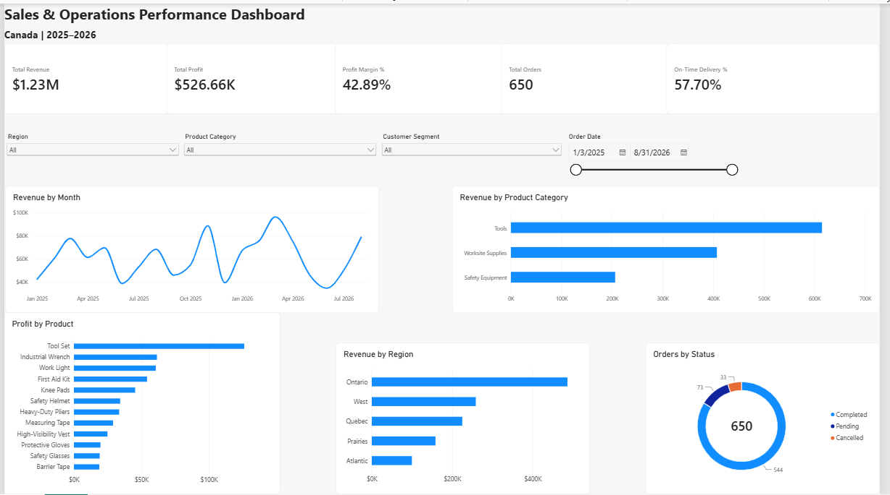

# Sales & Operations Performance Dashboard

A Power BI dashboard project analyzing synthetic Canadian sales and operations data across revenue, profit, product categories, regions, customer segments, order status, and delivery performance.

## Dashboard Preview



## Key KPIs

- Total Revenue
- Total Profit
- Profit Margin %
- Total Orders
- On-Time Delivery %

## Dashboard Features

- Monthly revenue trend analysis
- Revenue by product category
- Revenue by region
- Profit by product
- Order status breakdown
- Interactive slicers for region, product category, customer segment, and order date

## Tools Used

- Power BI Desktop
- Power Query
- DAX
- Excel
- Git / GitHub

## Data Preparation

The dataset was cleaned and transformed in Power Query before analysis.

Key preparation steps included:

- Correcting data types
- Removing duplicate order IDs
- Trimming and cleaning text fields
- Checking data quality and validation
- Creating a Month Start field for monthly trend analysis

## DAX Measures

```DAX
Total Revenue = SUM(Sales_Data[Revenue])

Total Profit = SUM(Sales_Data[Profit])

Profit Margin % =
DIVIDE([Total Profit], [Total Revenue], 0)

Total Orders =
DISTINCTCOUNT(Sales_Data[OrderID])

On-Time Delivery % =
DIVIDE(
    CALCULATE(
        COUNTROWS(Sales_Data),
        Sales_Data[OnTimeDelivery] = "Yes"
    ),
    CALCULATE(
        COUNTROWS(Sales_Data),
        Sales_Data[OnTimeDelivery] <> "N/A"
    ),
    0
)

## Dataset

The project uses a synthetic dataset created for portfolio and learning purposes. It contains 650 Canadian sales orders across multiple regions, products, customer segments, and order statuses.

## Files
Sales_Operations_Performance_Dashboard.pbix
PowerBI_Sales_Operations_Dataset.xlsx
dashboard-preview.png

## Author
Hritika Sharma
Computer Science Graduate | Data Analytics